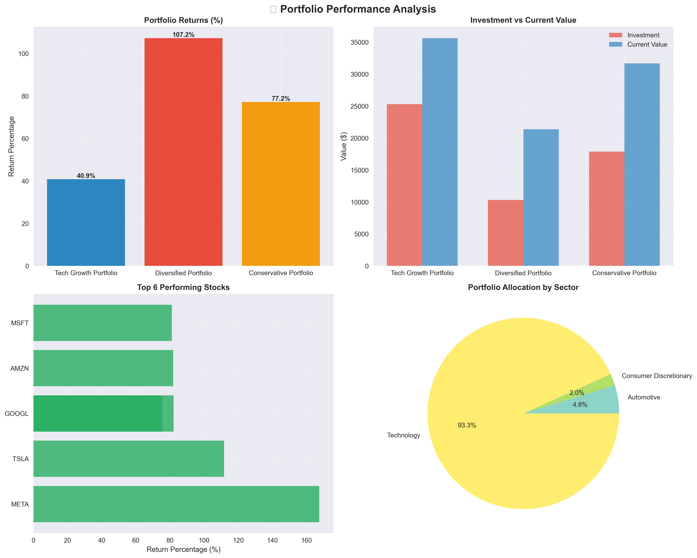
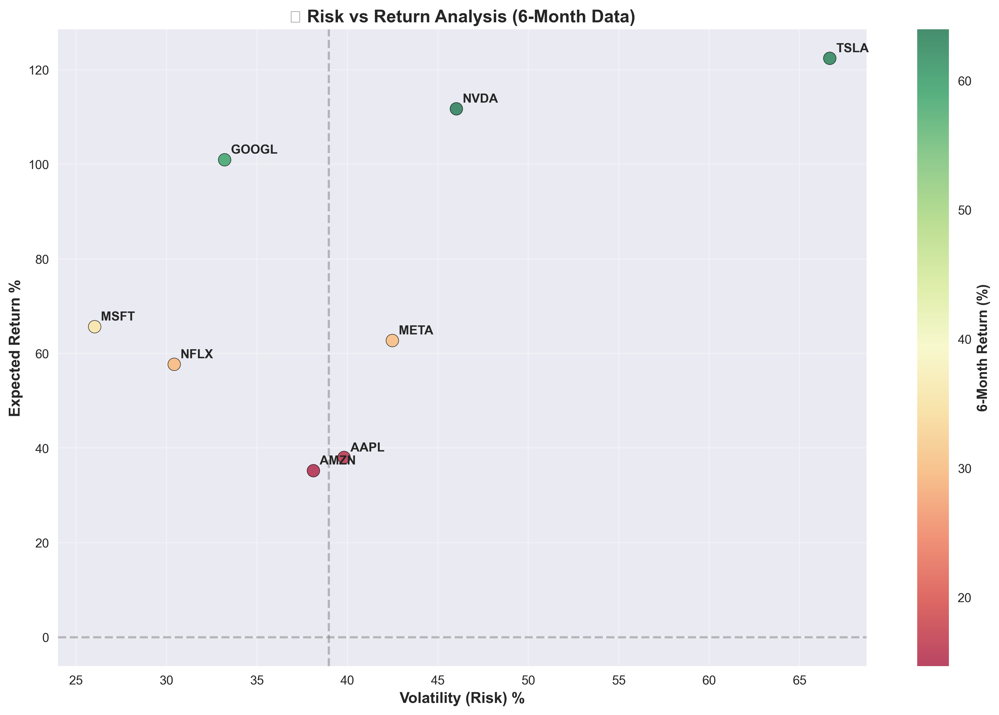
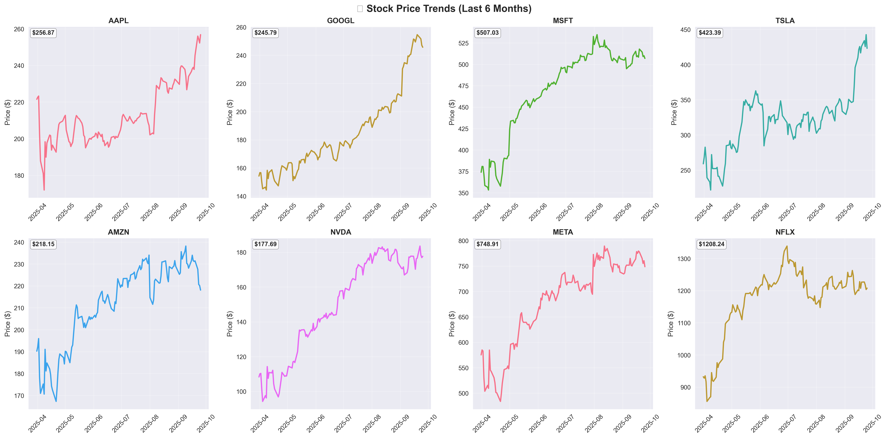

# Investment Portfolio Analysis - Data Analyst Project

## Project Overview

This project demonstrates key data analyst skills through investment portfolio analysis:

- **SQL Database Design**: Proper schema for financial data
- **API Integration**: Real-time data fetching from Yahoo Finance
- **Data Analysis**: Portfolio performance and risk calculations
- **Data Visualization**: Professional charts and insights
- **Python Programming**: Clean, documented, production-ready code
- **Environment**: Jupyter Notebook for interactive analysis

## Technical Stack

- **Database**: MySQL with normalized schema
- **API**: Yahoo Finance (yfinance library)
- **Analysis**: pandas, numpy for data manipulation
- **Visualization**: matplotlib, seaborn for charts
- **Language**: Python 3.8+

## Project Structure

```
├── database_schema.sql       # MySQL database setup
├── data_fetcher.py          # API data fetching script
├── portfolio_analyzer.py    # Analysis and visualization
├── requirements_analyst.txt # Python dependencies
└── README_analyst.md        # This documentation
```

## Quick Start

### 1. Database Setup
```bash
# Create MySQL database
mysql -u root -p < database_schema.sql
```

### 2. Launch Jupyter
```bash
jupyter notebook
```

### 3. Install Dependencies
```bash
!pip install -r requirements_analyst.txt []
```

### 4. Fetch Stock Data
```bash
python data_fetcher.ipynb
```

### 4. Run Analysis
```bash
[python portfolio_analyzer.ipynb](data_fetcher.ipynb)
```

## Key Features

### Data Pipeline
- **ETL Process**: Extract data from Yahoo Finance API, Transform for analysis, Load into MySQL
- **Data Validation**: Handle missing data and API rate limits
- **Automated Updates**: Schedule regular data refreshes

### Analysis Capabilities
- **Portfolio Performance**: Calculate returns, profit/loss by holding
- **Risk Analysis**: Volatility and expected returns using historical data
- **Alert System**: Detect significant price movements (±10% weekly changes)
- **Sector Analysis**: Portfolio allocation and diversification metrics

### Visualizations
1. **Portfolio Performance Dashboard**: Returns comparison, investment vs current value
2. **Risk-Return Scatter Plot**: Volatility vs expected returns with color-coded performance
3. **Stock Price Trends**: 6-month price movements for major stocks
4. **Sector Allocation**: Pie chart showing portfolio diversification

## Business Value

### Investment Insights
- **Performance Tracking**: Monitor portfolio returns and individual stock performance
- **Risk Assessment**: Identify high-risk positions and diversification opportunities  
- **Trend Analysis**: Spot market trends and timing for buy/sell decisions
- **Alert System**: Proactive notifications for significant price movements

### Data-Driven Decisions
- **Historical Analysis**: 6-month performance trends and volatility patterns
- **Comparative Analysis**: Portfolio performance benchmarking
- **Sector Exposure**: Risk management through diversification analysis

## Sample Outputs

The analysis generates:
- **Performance Report**: Comprehensive text summary with key metrics
- **Visual Charts**: High-quality PNG files for presentations
- **Data Tables**: Structured results for further analysis
- **Alert Notifications**: Real-time price change alerts

## Configuration

### Database Connection (data_fetcher.py, portfolio_analyzer.py)
```python
db_config = {
    'host': 'localhost',
    'user': 'your_username',
    'password': 'your_password',
    'database': 'portfolio_analysis'
}
```

### Customization Options
- **Time Periods**: Adjust analysis periods (daily, weekly, monthly)
- **Stock Universe**: Add/remove stocks in the database
- **Alert Thresholds**: Modify price change alert percentages
- **Visualization Styles**: Customize chart colors and layouts

## Data Schema

### Core Tables
- **stocks**: Master list of tracked securities
- **stock_prices**: Historical OHLCV data with proper indexing
- **portfolios**: Portfolio definitions and metadata
- **portfolio_holdings**: Individual positions with cost basis
- **price_alerts**: Automated alert system for significant moves

### Key Relationships
- Foreign key constraints ensure data integrity
- Optimized indexes for fast time-series queries
- Normalized design prevents data redundancy

## Skills Demonstrated

### Technical Skills
- **SQL**: Complex queries, joins, indexing, database design
- **Python**: Object-oriented programming, error handling, logging
- **APIs**: HTTP requests, rate limiting, data parsing
- **Data Analysis**: Statistical calculations, financial metrics
- **Visualization**: Professional charts, color theory, storytelling with data

### Business Skills
- **Financial Analysis**: Portfolio theory, risk-return relationships
- **Data Storytelling**: Clear insights and actionable recommendations
- **Automation**: Repeatable processes and error handling
- **Documentation**: Clear code comments and user guides

## Future Enhancements

- **BI Dashboard**: Interactive PowerBI dashboard
- **Advanced Metrics**: Sharpe ratio, beta, correlation analysis
- **Backtesting**: Historical strategy performance simulation
- **Real-time Streaming**: Live price feeds and automatic updates
- **Machine Learning**: Price prediction and portfolio optimization

## Sample Outputs

### Portfolio Performance


### Risk-Return Scatter Plot


### Stock Price Trends


---

*This project showcases practical data analyst skills with real financial data, demonstrating the ability to work with APIs, databases, and create actionable business insights through data visualization.*
